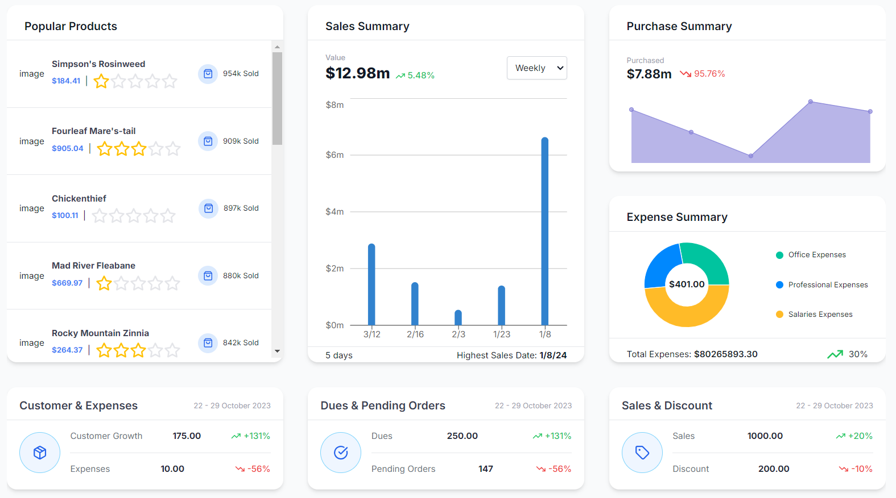
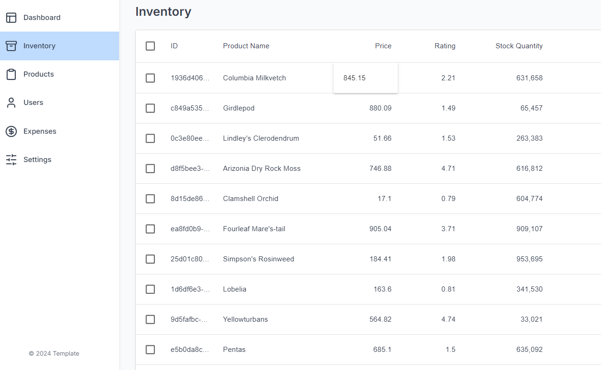

# Inventory Management System

## Overview

https://master.d2k34o168zq61g.amplifyapp.com/

This project is a comprehensive full-stack Inventory Management System designed to streamline and optimize the management of inventory, sales, expenses, and user data. The application offers a robust and modern interface for businesses to manage their operations efficiently. The project is developed with a focus on scalability, performance, and deployment on AWS services.

## Tech Stack

### Frontend

- **Next.js**: A powerful React framework for building server-side rendered applications, providing a fast and SEO-friendly frontend.
- **React**: Utilized as the core library for building the user interface, ensuring a responsive and dynamic user experience.
- **TypeScript**: Enhances code quality and maintainability with static type checking.
- **Tailwind CSS**: Implemented for styling, allowing for a utility-first approach to rapidly create a modern UI.
- **Material UI (@mui/material)**: Integrated for pre-built, accessible components that speed up development and maintain design consistency.
- **MUI DataGrid (@mui/x-data-grid)**: Used to create interactive and highly customizable tables for managing large datasets like inventory lists.
- **Redux Toolkit (@reduxjs/toolkit)**: Provides a predictable state container to manage the application state effectively.
- **React-Redux**: Combined with Redux Toolkit for connecting React components to the Redux store.
- **Redux Persist (redux-persist)**: Ensures that the application state is persisted across sessions, improving the user experience.
- **Axios**: Facilitates seamless communication with the backend API, handling HTTP requests efficiently.
- **Recharts**: Used to create dynamic, responsive charts that visualize sales, expenses, and other key metrics.
- **Lucide-React**: Provides a versatile set of icons, enhancing the visual appeal and usability of the application.
- **UUID**: Ensures unique identifiers are generated for various elements within the application, crucial for managing data consistency.
- **Numeral**: Used to format and manipulate numbers, especially for displaying currency, percentages, and other numerical data.
- **TW Colors**: Enhances Tailwind CSS by providing additional color utilities, allowing for more creative design choices.

### Backend

- **Node.js**: JavaScript runtime for building server-side applications.
- **Express.js**: A minimalist web framework for creating RESTful APIs.
- **TypeScript**: For type-safe backend development.
- **Prisma**: Next-generation ORM for database management.
- **PostgreSQL**: A powerful, open-source relational database system.
- **AWS**: Various services including EC2, S3, RDS, API Gateway, and Amplify for cloud deployment.

## Features

### Dashboard Overview

- **Sales Summary**: Implemented dynamic charts and statistics to visualize sales data, providing insights into revenue trends.
- **Expense Tracking**: Developed a comprehensive module for tracking and visualizing business expenses.
- **Popular Products**: Created a component to highlight top-performing products, aiding in inventory decisions.

### Inventory Management

- **CRUD Operations**: Built robust functionalities to Create, Read, Update, and Delete inventory items, leveraging MUI DataGrid for an interactive table interface.
- **Real-time Updates**: Ensured that inventory changes are reflected in real-time, improving decision-making and operational efficiency.

### User Management

- **Role-Based Access Control**: Integrated user management features that allow administrators to manage roles and permissions.
- **Profile Management**: Enabled users to update their profiles and view their permissions.

### Responsive Design

- **Cross-Device Compatibility**: Designed the UI to be fully responsive, ensuring a seamless experience on mobile, tablet, and desktop devices.

## Deployment

### AWS Deployment

This project is designed to be deployed on AWS, leveraging the following services:

- **AWS EC2**: Hosts the backend server, providing scalable computing capacity.
- **AWS RDS**: Manages the PostgreSQL database, ensuring high availability and scalability.
- **AWS API Gateway**: Serves as the entry point for all API requests, routing them to the appropriate backend services.
- **AWS S3**: Used for storing static assets like images, ensuring durability and high availability.
- **AWS Amplify**: Deploys the frontend application, offering a streamlined CI/CD process and easy integration with other AWS services.

### Deployment Steps

1. **Setup AWS Services**:
   - Create and configure an EC2 instance for the backend server.
   - Set up RDS for PostgreSQL database management.
   - Configure API Gateway to route requests to your EC2 instance.
   - Use S3 for storing and serving static assets.
   - Deploy the frontend using AWS Amplify, connecting it with your GitHub repository for continuous deployment.

2. **Clone the Repository**:
   ```bash
   git clone https://github.com/yourusername/inventory-management.git
   cd inventory-management
   ```

3. **Backend Setup**:
   - Navigate to the backend directory:
     ```bash
     cd inventory_backend
     ```
   - Install dependencies:
     ```bash
     npm install
     ```
   - Set up the PostgreSQL database and Prisma:
     ```bash
     npx prisma migrate dev
     ```
   - Run the backend server:
     ```bash
     npm run dev
     ```

4. **Frontend Setup**:
   - Navigate to the frontend directory:
     ```bash
     cd inventory-management-nextjs-master
     ```
   - Install dependencies:
     ```bash
     npm install
     ```
   - Run the development server:
     ```bash
     npm run dev
     ```
   - Access the application at `http://localhost:3000`.

## Screenshots




## Technical Skills Demonstrated

- **Advanced React and Next.js**: Server-side rendering, dynamic routing, and API integration.
- **State Management**: Implementing global state using Redux Toolkit for scalable applications.
- **Data Visualization**: Using Recharts to create interactive and insightful data visualizations.
- **UI/UX Design**: Leveraging Tailwind CSS, Material UI, and Lucide-React for a modern, responsive user interface.
- **TypeScript**: Strong typing and interfaces for robust code.
- **API Development**: Creating RESTful APIs with Express.js and integrating them with the frontend.
- **Database Management**: Using Prisma and PostgreSQL for efficient data storage and retrieval.
- **Cloud Deployment**: Leveraging AWS services (EC2, RDS, S3, API Gateway, Amplify) for scalable and reliable deployment.

## License

This project is licensed under the MIT License.
