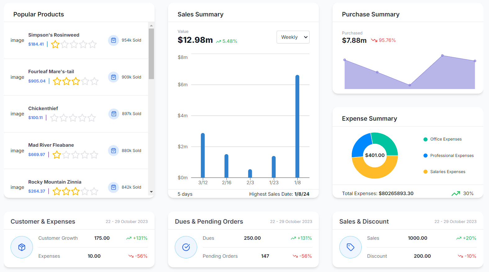

# Inventory Management Frontend

## Overview

This frontend application is part of a full-stack Inventory Management System, meticulously crafted to streamline and optimize the management of inventory, sales, expenses, and user data. The project offers an intuitive and modern interface that integrates seamlessly with the backend, delivering a comprehensive and responsive experience across all devices.

### TODO

1. Fix Images (It would be fun to use ai to generate images for products)
2. User Management and Authentication

## Tech Stack

- **Next.js**: Leveraged for its powerful server-side rendering capabilities, providing a fast and SEO-friendly frontend.
- **React**: Utilized as the core library for building the user interface, ensuring a responsive and dynamic user experience.
- **TypeScript**: Used throughout the project to enhance code quality and maintainability with static type checking.
- **Tailwind CSS**: Implemented for styling, allowing for a utility-first approach to rapidly create a modern UI.
- **Material UI (@mui/material)**: Integrated for pre-built, accessible components that speed up development and maintain design consistency.
- **MUI DataGrid (@mui/x-data-grid)**: Used to create interactive and highly customizable tables for managing large datasets like inventory lists.
- **Redux Toolkit (@reduxjs/toolkit)**: Provides a predictable state container to manage the application state effectively.
- **React-Redux**: Combined with Redux Toolkit for connecting React components to the Redux store.
- **Redux Persist (redux-persist)**: Ensures that the application state is persisted across sessions, improving the user experience.
- **Axios**: Facilitates seamless communication with the backend API, handling HTTP requests efficiently.
- **Recharts**: Used to create dynamic, responsive charts that visualize sales, expenses, and other key metrics.
- **Lucide-React**: Provides a versatile set of icons, enhancing the visual appeal and usability of the application.
- **UUID**: Ensures unique identifiers are generated for various elements within the application, crucial for managing data consistency.
- **Numeral**: Used to format and manipulate numbers, especially for displaying currency, percentages, and other numerical data.
- **TW Colors**: Enhances Tailwind CSS by providing additional color utilities, allowing for more creative design choices.

## Accomplishments

### Dashboard Overview

- **Sales Summary**: Implemented dynamic charts and statistics to visualize sales data, providing insights into revenue trends.
- **Expense Tracking**: Developed a comprehensive module for tracking and visualizing business expenses.
- **Popular Products**: Created a component to highlight top-performing products, aiding in inventory decisions.

### Inventory Management

- **CRUD Operations**: Built robust functionalities to Create, Read, Update, and Delete inventory items, leveraging MUI DataGrid for an interactive table interface.
- **Real-time Updates**: Ensured that inventory changes are reflected in real-time, improving decision-making and operational efficiency.

### TODO: User Management

- **Role-Based Access Control**: Integrated user management features that allow administrators to manage roles and permissions.
- **Profile Management**: Enabled users to update their profiles and view their permissions.

### Responsive Design

- **Cross-Device Compatibility**: Designed the UI to be fully responsive, ensuring a seamless experience on mobile, tablet, and desktop devices.

## Getting Started

### Prerequisites

- Node.js (v14 or higher)
- npm or yarn

### Installation

1. Clone the repository:
   ```bash
   git clone https://github.com/yourusername/inventory-management.git
   cd inventory-management
   ```

2. Navigate to the frontend directory:
   ```bash
   cd inventory-management-nextjs-master
   ```

3. Install dependencies:
   ```bash
   npm install
   ```

4. Set up environment variables:
   - Create a `.env` file in the root of the frontend directory.
   - Add the necessary environment variables as specified in the `.env.example` file.

5. Run the development server:
   ```bash
   npm run dev
   ```

6. Open your browser and go to `http://localhost:3000` to view the application.

## Deployment

The frontend can be easily deployed using platforms like Vercel or Netlify.

## Screenshots




## Technical Skills Demonstrated

- **Advanced React and Next.js**: Server-side rendering, dynamic routing, and API integration.
- **State Management**: Implementing global state using Redux Toolkit for scalable applications.
- **Data Visualization**: Using Recharts to create interactive and insightful data visualizations.
- **UI/UX Design**: Leveraging Tailwind CSS, Material UI, and Lucide-React for a modern, responsive user interface.
- **TypeScript**: Strong typing and interfaces for robust code.
- **API Integration**: Seamless communication with the backend using Axios for data fetching and state synchronization.

## License

This project is licensed under the MIT License.
